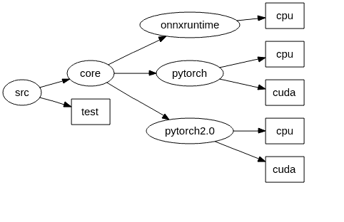

# libxop.so  

**libxop.so**, which strives to include custom op of all backend inference engines, such as ONNXRuntime and libtorch.     
Considering that it is almost impossible for the edge device side to use it to inference, and it is mainly used to support model transformation across DNN frameworks and graph optimization, so only the version of x86 architecture has been developed.

## Architecture  
  

## Roadmap   
Useful, easy to use, indispensable    

## Requirements  
* cmake >= 3.15.5     
* [cuda 11.4](https://developer.nvidia.com/cuda-11.4-download-archive)`Recommended`   
* g++ >= 7.5 or 9.3`Recommended`    
* ubnutu >= 18.04 or 20.04`Recommended`  
* onnxruntime-linux-x64-1.8.1      

## Build and Installation (docker)   

```
git clone -b develop http://10.94.119.155/team/percep/porting/libraries/xop.git   
docker pull 10.95.61.122:80/devops/dds_cross_compile:v3.3.1 

docker run -it -v /tmp/.X11-unix:/tmp/.X11-unix -e DISPLAY=unix$DISPLAY --privileged --network host -v /home/igs:/root/code --gpus all --name dds-conan-v3.3.1 6e5b2467c5be bash

# enter into docker env 
cd xop  
sh ./scripts/build_project.sh  x86_64  
```  
## Release   
* [xop](http://10.94.119.155/team/percep/porting/libraries/xop/-/tree/develop)   

## Known Issues   
```  
none     

```  
## Reference     
* [CppGuide](https://google.github.io/styleguide/cppguide.html)     
* [CppCoreGuidelines](https://github.com/isocpp/CppCoreGuidelines/blob/master/CppCoreGuidelines.md#t42-use-template-aliases-to-simplify-notation-and-hide-implementation-details)   
* [changelog](https://keepachangelog.com/en/1.0.0/)  
* [special-notes](https://topic.alibabacloud.com/a/special-notes-todo-font-classtopic-s-color00c1defixmefont-xxx_8_8_31405478.html)   
* [binutils](https://sourceware.org/binutils/docs/ld/Options.html)  
* [link-options](https://gcc.gnu.org/onlinedocs/gcc/Link-Options.html#Link-Options)   
* [c++11](http://en.wikipedia.org/wiki/C++11)   
* [abseil](https://github.com/abseil/abseil-cpp)    

## Copyright and License   
```
xop is provided under the [Apache-2.0 license](LICENSE).  
```
